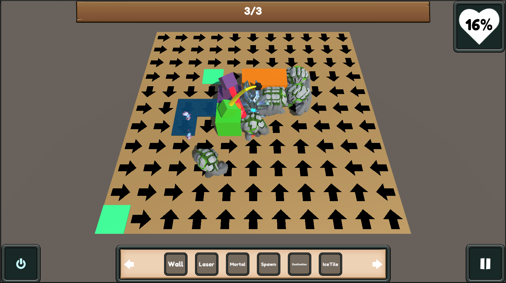

# Legacy Tower Defence

Данный проект представляет собой минимальную реализацию игры в жанре TowerDefence.

Цель - углубление в архитектуру и получение первичных практических навыков. В ходе решения реальных практических задач было принято решение довести данный проект до ближайшей конечной точки и закрыть, т.к проще написать новый, чем переписывать половину старого под желаемые требования.

    
    
Геймплейный кадр игры

